CusToast
========
> 自定义显示样式的全局静态Toast，具有即时显示的特性。  

> [Download Demo Apk](https://github.com/liying2008/CusToast/releases/download/v0.2/custoast_demo_v0.2.apk)

引入(Download)
----
## Use Gradle  
```gradle  
compile 'cc.duduhuo.custoast:custoast:0.2'
```

## Or Maven  
```xml  
<dependency>
  <groupId>cc.duduhuo.custoast</groupId>
  <artifactId>custoast</artifactId>
  <version>0.2</version>
  <type>pom</type>
</dependency>
```

使用(Usage)
----
## 第一步(The First Step)
在应用的Application类的<code>onCreate</code>方法中初始化<code>CusToast</code>类。  
可以使用<code>CusToast.init(Application)</code>方法<i>**或**</i><code>CusToast.init(Application, Style)</code>方法。  
如下所示：  

```java  
public class MyApplication extends Application {

    @Override
    public void onCreate() {
        super.onCreate();
        // 初始化CusToast库（两种方式选其一）
        // 方式1：初始化同时指定CusToast的默认显示样式
        CusToast.init(this, CusToast.Style.RED);
        // 方式2：初始化，使用默认显示样式
        // CusToast.init(this);
    }
}
```

**注意：不要忘记在<code>AndroidManifest.xml</code>文件中的<code>application</code>节点下配置<code>android:name</code>属性。**    
## 第二步(The Second Step)
尽情使用。  
> **Examples：**

```java  
CusToast.showToast("Toast 1");
```

```java  
CusToast.showToast("Toast 3", Toast.LENGTH_LONG, CusToast.Style.LIGHT_RED);
```

```java  
DToast toast = CusToast.getToast("自定义Toast");
toast.setCusToastGravity(Gravity.CENTER, 0, 0)
        .setTextSize(16)
        .setStyle(CusToast.Style.GRAY_1)
        .setTextColor(Color.WHITE)
        // .setBackground(R.mipmap.ic_launcher)
        // .setBackgroundColor(0xffff3444)
        .setCusToastDuration(Toast.LENGTH_SHORT)
        .show();
```

```java  
CusToast.getToastWithSub("主标题", "次标题").show();
```

```java  
CusToast.getToastWithSub(R.string.main_text, R.string.sub_text)
        .setCusToastDuration(Toast.LENGTH_LONG)
        .setStyle(CusToast.Style.LIGHT_BLUE)
        .setTextSize(16)
        .setSubTextSize(12)
        .setCusToastText("主标题主标题主标题主标题")
        .setSubText("次标题次标题次标题次标题")
        .setLineColor(Color.GREEN)
        .show();
```

```java  
CusToast.getToastWithIcon("CusToast", R.mipmap.ic_launcher).show();
```

```java  
CusToast.getToastWithIcon(R.string.toast2, R.mipmap.ic_launcher)
        .setCusToastText("带图片的Toast")
        .setStyle(CusToast.Style.LIGHT_BLUE)
        .setTextColor(0xff67babf)
        .setTextSize(20)
        .setIconSize(40)
        .setCusToastDuration(Toast.LENGTH_LONG)
        .setIcon(R.drawable.icon_sample)
        .show();
```

方法说明(Methods)
----
### CusToast类的方法说明  
| 方法名 | 返回值类型 | 备注
| :--- | :--: |  :---  
| init(Application) | void | 初始化CusToast库。不设置CusToast的显示样式时则使用CusToast的默认样式(即<code>CusToast.Style.DEFAULT</code>)
| init(Application, Style) | void | 初始化CusToast库。不设置CusToast的显示样式时则使用第二个参数指定的样式)
| showToast(@StringRes int) | void | 显示CusToast
| showToast(@NonNull CharSequence) | void |  显示CusToast
| showToast(@StringRes int, Style) | void |  使用指定的样式显示CusToast
| showToast(@NonNull CharSequence, Style) | void |  使用指定的样式显示CusToast
| showToast(@StringRes int, @Duration int) | void |  以指定的时长显示CusToast
| showToast(@NonNull CharSequence, @Duration int) | void |  以指定的时长显示CusToast
| showToast(@StringRes int, @Duration int, Style) | void |  以指定的时长，使用指定的样式显示CusToast
| showToast(@NonNull CharSequence, @Duration int, Style) | void |  以指定的时长，使用指定的样式显示CusToast
| getToast(@NonNull CharSequence) | DToast |  得到一个DToast的实例，需要调用<code>show()</code>方法才可以显示
| getToast(@StringRes int) | DToast |  得到一个DToast的实例，需要调用<code>show()</code>方法才可以显示
| getToastWithSub(@StringRes int, @StringRes int) | DToast | 得到一个带次标题的DToast的实例，需要调用<code>show()</code>方法才可以显示
| getToastWithSub(@NonNull CharSequence, @StringRes int) | DToast | 得到一个带次标题的DToast的实例，需要调用<code>show()</code>方法才可以显示
| getToastWithSub(@StringRes int, @NonNull CharSequence) | DToast | 得到一个带次标题的DToast的实例，需要调用<code>show()</code>方法才可以显示
| getToastWithSub(@NonNull CharSequence, @NonNull CharSequence) | DToast | 得到一个带次标题的DToast的实例，需要调用<code>show()</code>方法才可以显示
| getToastWithIcon(@NonNull CharSequence, @DrawableRes int) | DToast | 得到一个带图标的DToast的实例，需要调用<code>show()</code>方法才可以显示
| getToastWithIcon(@StringRes int, @DrawableRes int) | DToast | 得到一个带图标的DToast的实例，需要调用<code>show()</code>方法才可以显示
| ~~getApplication()~~ | Application | 得到应用Application类实例

### DToast类的方法说明  
| 方法名 | 返回值类型 | 备注
| :--- | :--: |  :---  
| setView(Application, CusToast.Style) | DToast | 得到一个普通样式的DToast实例
| setSubView(Application, CusToast.Style) | DToast | 得到一个带次标题的DToast实例
| setIconView(Application, CusToast.Style) | DToast | 得到一个带图标的DToast实例
| getView() | View | 得到当前DToast实例的视图
| getText() | String | 得到当前DToast实例的显示文本
| setCusToastText(@StringRes int) | DToast |  设置当前DToast实例的显示文本
| setCusToastText(@NonNull CharSequence) | DToast |  设置当前DToast实例的显示文本
| setSubText(@StringRes int) | DToast |  设置当前DToast实例的次标题文本
| setSubText(CharSequence) | DToast |  设置当前DToast实例的次标题文本
| setIcon(@DrawableRes int) | DToast |  设置当前DToast实例的图标
| setIcon(Bitmap) | DToast |  设置当前DToast实例的图标
| setIcon(Drawable) | DToast |  设置当前DToast实例的图标
| setTextSize(int) | DToast |  设置当前DToast实例的文本字体大小(单位：sp)
| setIconSize(int) | DToast |  设置当前DToast实例的图标大小(单位：dp)
| setSubTextSize(int) | DToast |  设置当前DToast实例的次标题字体大小(单位：sp)
| setTextColor(int) | DToast |  设置当前DToast实例的文本字体颜色
| setSubTextColor(int) | DToast |  设置当前DToast实例的次标题字体颜色
| setStyle(CusToast.Style) | DToast |  设置当前DToast实例的样式
| setBackground(@DrawableRes int) | DToast | 设置当前DToast实例的背景
| setBackground(Drawable) | DToast | 设置当前DToast实例的背景
| setBackgroundColor(int) | DToast | 设置当前DToast实例的背景颜色
| setLineColor(int) | DToast | 设置当前DToast实例主文本和次标题分割线的颜色
| setCusToastDuration(@Duration int) | DToast | 设置当前DToast显示的时长
| setCusToastGravity(int, int, int) | DToast | 设置当前DToast显示的位置
| setCusToastMargin(float, float) | DToast | 设置当前DToast视图的margins

### CusToast.Style枚举列表  
| Style | 预览
| :--- | :--: 
| DEFAULT | 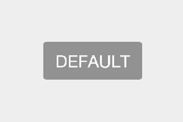
| LIGHT_BLUE | 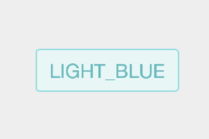
| BLUE | 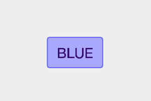
| LIGHT_RED | 
| RED | 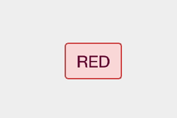
| LIGHT_GREEN | 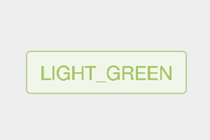
| GREEN | 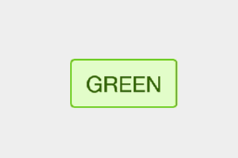
| LIGHT_YELLOW | 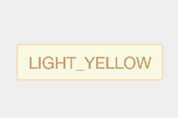
| YELLOW | 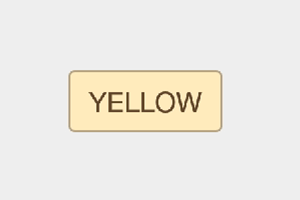
| GRAY_1 | 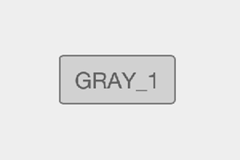

### 其他样式
| 样式 | 预览
| :--- | :--: 
| CusToastWithSub | 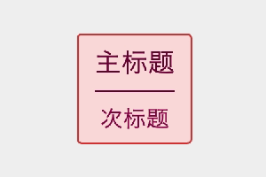
| CusToastWithIcon | 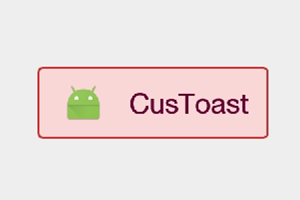

作者(Author)
----
李颖
新浪微博：[@独毒火][2]
邮箱：[liruoer2008@yeah.net][3]

日期(Date)
----
2016-12-09

License
----

	Copyright 2016 LiYing
	
	Licensed under the Apache License, Version 2.0 (the "License");
	you may not use this file except in compliance with the License.
	You may obtain a copy of the License at
	
	   http://www.apache.org/licenses/LICENSE-2.0
	
	Unless required by applicable law or agreed to in writing, software
	distributed under the License is distributed on an "AS IS" BASIS,
	WITHOUT WARRANTIES OR CONDITIONS OF ANY KIND, either express or implied.
	See the License for the specific language governing permissions and
	limitations under the License.


  [2]: http://weibo.com/neuliying
  [3]: mailto:liruoer2008@yeah.net
